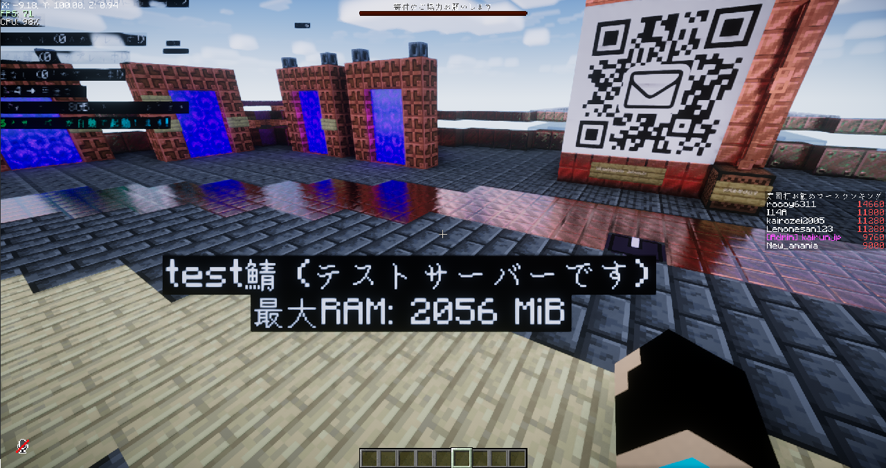

# Ptero-PlaceholderExpansion

Pterodactylのサーバー情報をPlaceholderAPIで取得するプラグイン

## プレースホルダーの使用方法

以下のプレースホルダーを使用して、Pterodactylのサーバー情報を取得できます。

```
%ptero_サーバーID_JSONパス%
```

## サンプル


```
"%ptero_9be90f7c_name%鯖 (%ptero_9be90f7c_description%)"
"最大RAM: %ptero_9be90f7c_limits.memory% MiB"
"バージョン: %ptero_9be90f7c_relationships.variables.data[0].attributes.server_value%"
"ステータス: %ptero_9be90f7c_current_state%"
```

### Pterodactyl APIレスポンスが以下の場合上記のようになります
attributesのlimitsのmemoryを表示したい場合は`limits.memory`となります

```json
{
    "attributes": {
        "server_owner": true,
        "identifier": "9be90f7c",
        "internal_id": 18,
        "uuid": "56d995cd-8195-4f74-a382-0b90786c0f54",
        "name": "test",
        "node": "rack-server",
        "is_node_under_maintenance": false,
        "sftp_details": {
            "ip": "mc.kairun.jp",
            "port": 2023
        },
        "description": "テストサーバーです",
        "limits": {
            "memory": 4096,
            "swap": 16384,
            "disk": 2048,
            "io": 500,
            "cpu": 0,
            "threads": null,
            "oom_disabled": true
        },
        "current_state": "offline",
        "is_suspended": false,
        "resources": {
          "memory_bytes": 0,
          "cpu_absolute": 0,
....
```

### インストール方法

1. PlaceholderAPIを導入していない場合は、導入してください。
2. リリースページから最新のjarファイルをダウンロードします。
3. `plugins/PlaceholderAPI/expansions` フォルダにjarファイルを配置します。
4. `/papi reload` コマンドで拡張をリロードします。
5. `plugins/PlaceholderAPI/config.yml` ファイルに以下の設定を追加します。

    ```yaml
      ptero:
        pterodactyl:
        url: https://panel.example.com // PterodactylのURL
        apiKey: ptlc_XXXXXXXXXXXXXXXX // PterodactylのAPIキー
        cacheTime: 60
        error_msg: ERROR
        custom_headers: // カスタムヘッダー (もし必要なら)
          CF-Access-Client-Id: XXXXX.access // 例: Cloudflare AccessのClient ID
          CF-Access-Client-Secret: XXXXXX // 例: Cloudflare AccessのClient Secret
    ```

### Special Thanks
- Kamesuta